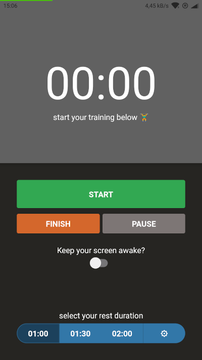
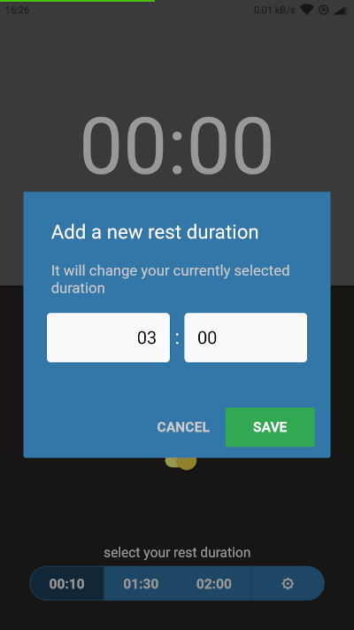
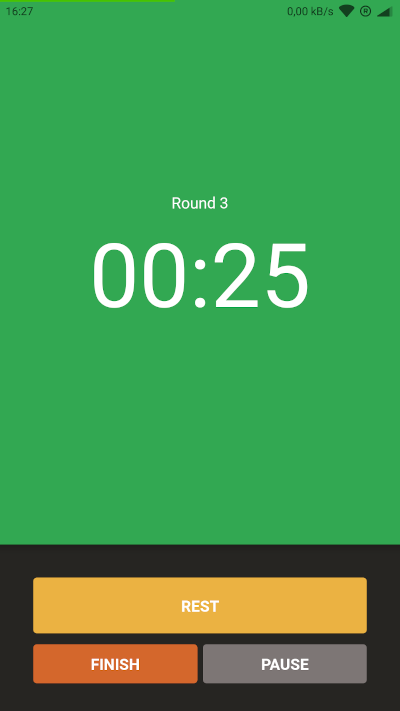
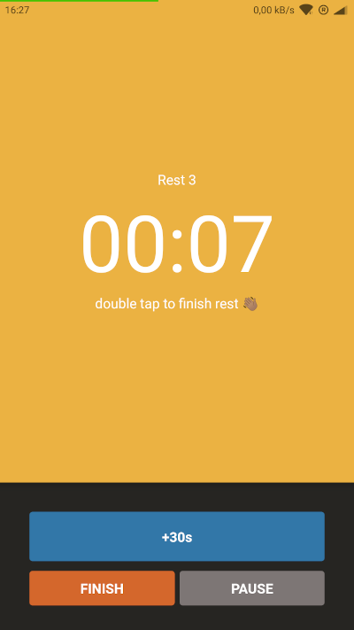
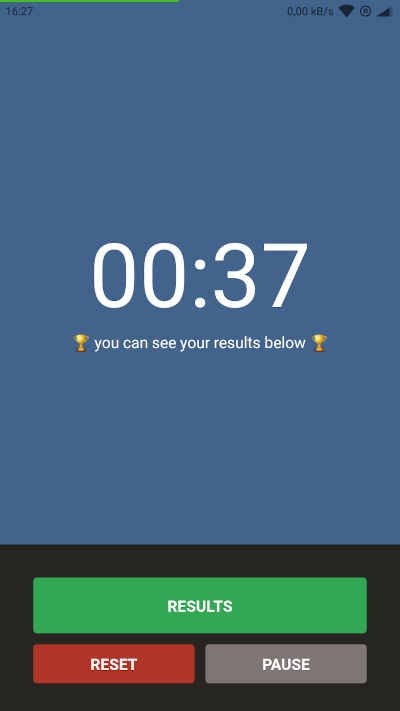
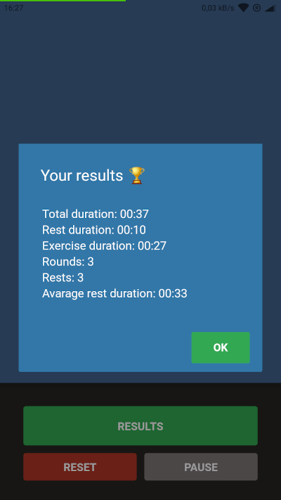

# Workout Timer

Timer that helps you keeping track of workout time/rests. Bulit with React Native and Expo.

You can download latest APK build [here](https://drive.google.com/file/d/1CHqji9uJ23zBBvn0qAiKZAY-a8MS2WSq/view?usp=sharing)

## Preview








## Running

Install dependencies:
```bash
npm install
```

Run Expo development tool:
```bash
npm start
```

> Expo DevTools default address is [http://localhost:19002](http://localhost:19002)